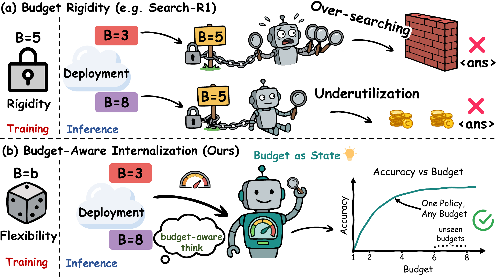
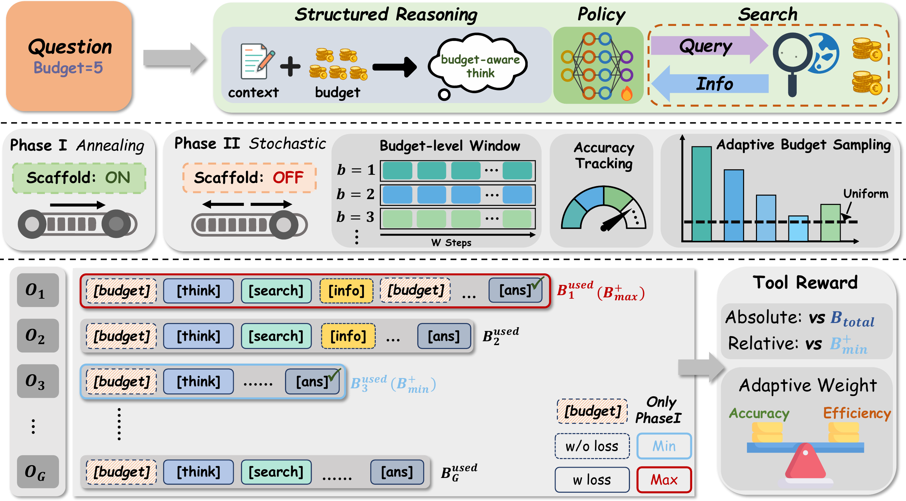

# AnySearch: One Policy, Any Budget

Official code for **“One Policy, Any Budget: Internalizing Budget-Aware Search
via Reinforcement Learning.”**

**EMNLP 2026 Findings**

<p>
  <a href="https://arxiv.org/pdf/2609.00813"></a>
</p>


AnySearch trains a single search policy that operates under different
inference-time search budgets through a two-phase budget curriculum and
group-level rewards for answer quality and search efficiency.

## Overview

<p align="center">
  
</p>

<p align="center"><em>
Fixed-budget policies can over-search or underuse the available budget. AnySearch
internalizes the budget as part of the policy state and uses one policy across
seen and unseen budgets.
</em></p>

The AnySearch method consists of four components:

1. **Budget-aware curriculum.** Phase I anneals the search budget from `B=5` to
   `B=1`; Phase II adaptively samples budgets using recent per-budget accuracy.
2. **Budgeted tool interaction.** The policy alternates between reasoning,
   search, retrieved information, and a final answer while respecting its
   assigned search budget.
3. **Group-level efficiency reward.** Each GRPO group shares one budget and is
   scored using answer accuracy, format, length, and absolute/relative search
   efficiency.
4. **Budget-generalized evaluation.** One trained checkpoint is evaluated on
   seven QA datasets with budgets `B=1..8`.

### Framework

<p align="center">
  
</p>

<p align="center"><em>
Phase I establishes budget-aware reasoning with a scaffold and descending
budgets. Phase II removes the scaffold, adaptively samples budgets, and applies
an efficiency-aware group reward.
</em></p>

The figures above summarize the motivation and training framework.

## Repository layout

```text
.
├── train.py / train_async.py     # training entry points
├── slime/                        # distributed training framework
└── examples/anysearch/
    ├── configs/                  # training, evaluation, and ablation configs
    ├── assets/                   # method figures used by this README
    ├── retrieval/                # asynchronous retrieval client and health checks
    ├── services/retriever/       # E5 + FAISS retrieval service
    ├── slime_ext/                # data-source, rollout, and reward integration
    ├── scripts/                  # data, training, evaluation, and analysis launchers
    ├── curriculum.py             # two-phase budget curriculum
    ├── prompts.py / protocol.py  # prompts and tool-interaction protocol
    └── rewards.py                # composite group reward
```

This repository is built on
[Slime commit `52fc971b`](https://github.com/THUDM/slime/commit/52fc971bfe4ad7a1e857ac158d626d4b6373474d).
The AnySearch-specific implementation is located in
[`examples/anysearch`](examples/anysearch).

## Installation

Prepare the normal Slime environment with Megatron-LM, Ray, SGLang, and the
appropriate CUDA/PyTorch stack, then install this fork from the repository root:

```bash
python -m pip install -e .
python -m pip install -r examples/anysearch/requirements.txt
```

Additional dependencies are separated by task:

```bash
# Dataset preparation
python -m pip install -r examples/anysearch/requirements-data.txt

# CPU retrieval service; use a CUDA-compatible FAISS installation for GPU retrieval
python -m pip install -r examples/anysearch/requirements-retriever-cpu.txt
```

Follow Slime's [quick-start guide](docs/en/get_started/quick_start.md) to prepare
Megatron-LM and SGLang. Convert Hugging Face weights with
[`tools/convert_hf_to_torch_dist.py`](tools/convert_hf_to_torch_dist.py). All
AnySearch environment variables are listed in
[`examples/anysearch/.env.example`](examples/anysearch/.env.example).

## Data preparation

All machine-specific locations are supplied through environment variables. Use
absolute paths; no model, dataset, index, or checkpoint is stored in this repo.

```bash
export DATA_DIR="<absolute-path>/anysearch-data"
bash examples/anysearch/scripts/prepare_all_data.sh
```

This downloads the public
[FlashRAG datasets](https://huggingface.co/datasets/RUC-NLPIR/FlashRAG_datasets)
and prepares NQ and HotpotQA for training, plus NQ, TriviaQA, PopQA, HotpotQA,
2WikiMultiHopQA, MuSiQue, and Bamboogle for evaluation. Prompt data is stored as
Parquet with the following logical schema:

```text
question: string
label:    {target: list[string]}
metadata: {dataset: string, split: string, index: int}
```

## Retrieval service

AnySearch uses E5-base-v2 embeddings and exact FAISS inner-product retrieval over
the Wikipedia 2018 corpus.

```bash
export RETRIEVER_INDEX="<absolute-path>/e5_Flat.index"
export RETRIEVER_CORPUS="<absolute-path>/wiki-18.jsonl"
export RETRIEVER_MODEL="intfloat/e5-base-v2"

# Set to 1 only when a compatible FAISS GPU installation is available.
export RETRIEVER_FAISS_GPU=0
bash examples/anysearch/scripts/serve_retriever.sh
```

The training and evaluation launchers verify the retriever health response
before submitting a Ray job.

## Training

Provide the Hugging Face checkpoint used by SGLang, the corresponding Megatron
torch-distributed checkpoint, the prepared training Parquet, and an output path:

```bash
export MEGATRON_ROOT="<absolute-path>/Megatron-LM"
export HF_CHECKPOINT="<absolute-path>/Qwen2.5-7B-Instruct"
export REF_LOAD="<absolute-path>/Qwen2.5-7B-Instruct_torch_dist"
export TRAIN_DATA="<absolute-path>/anysearch-data/train/nq_hotpotqa_train.parquet"
export SAVE_CHECKPOINT="<absolute-path>/checkpoints/qwen2.5-anysearch"
export CUDA_VISIBLE_DEVICES=0,1,2,3,4,5,6,7

bash examples/anysearch/scripts/run_qwen2.5_7b.sh
```

Supported launchers are:

```bash
bash examples/anysearch/scripts/run_qwen2.5_7b.sh
bash examples/anysearch/scripts/run_llama3.1_8b.sh
bash examples/anysearch/scripts/run_qwen3_4b.sh
```

Append `--dry-run` to inspect the resolved Slime command without starting Ray or
contacting the retriever. Set `LOAD_CHECKPOINT` to resume a previous run.

## Evaluation

The default evaluation covers all seven datasets at budgets `B=1..8`:

```bash
export LOAD_CHECKPOINT="<absolute-path>/checkpoints/qwen2.5-anysearch"
export EVAL_DATA_DIR="<absolute-path>/anysearch-data/eval"
export ANYSEARCH_EVAL_OUTPUT_DIR="<absolute-path>/results/qwen2.5/seed-42"
export EVAL_SEED=42

bash examples/anysearch/scripts/run_eval.sh --model qwen2.5-7b-instruct
```

Aggregate independent runs and plot budget curves with:

```bash
RESULTS_DIR="$ANYSEARCH_EVAL_OUTPUT_DIR" \
  bash examples/anysearch/scripts/summarize.sh
```

The evaluator records exact match, tool productivity, average search calls,
generated/retrieved token counts, truncations, and failed episodes. No generated
benchmark results are bundled in this repository. The reported results use
three independent evaluation seeds; the launchers use `42`, `43`, and `44`.

## Configuration

The canonical configuration is
[`examples/anysearch/configs/anysearch.yaml`](examples/anysearch/configs/anysearch.yaml).
Ablations are declared in
[`configs/ablations.yaml`](examples/anysearch/configs/ablations.yaml).

```bash
# Validate the experiment geometry and all 56 evaluation entries.
python examples/anysearch/scripts/check_config.py

# Materialize and run one ablation.
bash examples/anysearch/scripts/materialize_ablation.sh \
  no_tool_reward examples/anysearch/outputs/configs/no_tool_reward.yaml
bash examples/anysearch/scripts/run_qwen3_4b.sh \
  --config examples/anysearch/outputs/configs/no_tool_reward.yaml
```

## Citation

If you find AnySearch useful in your research, please cite our paper:

```bibtex
@misc{sun2026anysearch,
  title         = {One Policy, Any Budget: Internalizing Budget-Aware Search via Reinforcement Learning},
  author        = {Sun, Xiaowei and Li, Jin and Hong, Yili and Fu, Yikun and Xiao, Yanghua},
  year          = {2026},
  eprint        = {2609.00813},
  archivePrefix = {arXiv},
  primaryClass  = {cs.AI},
  url           = {https://arxiv.org/abs/2609.00813}
}
```

## Acknowledgements

This project builds on [Slime](https://github.com/THUDM/slime) and
[Search-R1](https://github.com/PeterGriffinJin/Search-R1). We thank the authors
and contributors of these projects.

## License

Repository code is provided under the Apache License 2.0. Models, datasets,
Wikipedia passages, indexes, and generated checkpoints retain their own terms.
See [NOTICE](NOTICE) and [THIRD_PARTY_NOTICES.md](THIRD_PARTY_NOTICES.md).
